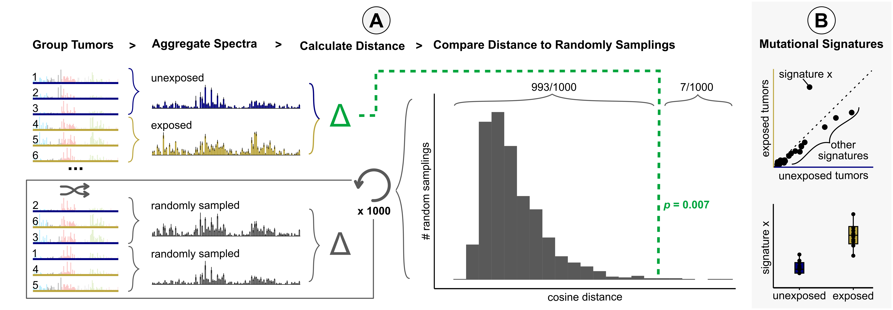

# Code to accompany manuscript: *A signature-agnostic test for differences between tumor mutation spectra reveals carcinogen and ancestry effects*

- [Installation](#installation)
- [Reproducing manuscript analysis](#reproducing-manuscript-analysis)
- [Usage](#usage)
- [Citation](#citation)

<br/>

## Installation

Clone project repo

```sh
git clone https://github.com/sfhart33/AMSD_cancer_mutation_spectra.git
```

Install R package "[mutspecdist](https://github.com/sfhart33/mutspecdist)" to run AMSD

```r
# install.packages("devtools")
library(devtools)
devtools::install_github("sfhart33/mutspecdist")
```

<br/>

## Reproducing manuscript analysis

### Dependencies


```r
install.packages(c("tidyverse","ggpubr","ggrepel","RColorBrewer","svglite"))

devtools::install_github("kgori/sigfit")
```

*versions indicate those used for original analysis*
- tidyverse               v2.0.0
- ggpubr                  v0.6.0   (for multi-panel plotting)
- ggrepel                 v0.9.6   (for figure labels)
- RColorBrewer            v1.1-3   (color palettes)
- svglite                 v2.1.3   (output scalable vector graphics)
- sigfit                  v2.2     (signature fitting tool)
- SigProfilerAssignment   v0.2.0   (signature fitting tool - PYTHON)
*See [SigProfilerAssignmentR](https://github.com/AlexandrovLab/SigProfilerAssignmentR) for SigProfiler installation instructions*

### Run scripts to generate figures

In R:
```r
setwd("./AMSD_cancer_mutation_spectra/scripts")

# Generates simulations from Supp Fig 1
     source("amsd_simulations.R")   
     source("amsd_simulations_v_fitting.R")   
     source("amsd_simulations_fitting_plotting.R")   
# Runs AMSD on mouse tumors grouped by carcinogen exposure
     source("amsd_mouse_carcinogens.R")   
     source("amsd_mouse_plotting.R")
     source("amsd_mouse_snvs_oxazepam.R") # deeper dive into what's causing oxazepam difference (requires additional Bioconductor packages)
# Runs AMSD on mesothelioma grouped by professional asbestos exposure and plots results
     source("amsd_asbestos.R")  
# Runs AMSD on TCGA cancer types grouped by genetic ancestry
     source("amsd_tcga_ancestry_withfitting.R")        
     source("amsd_tcga_plotting.R")
# Compare ASMD results to other methods
     source("amsd_v_sigs_comparisons.R")
     source("amsd_vs_sigvar.R")
# Compare ASMD results whether weighting by mutations
     source("amsd_mouse_carcinogens_unweighted.R")
     source("amsd_tcga_ancestry_unweighted.R")
     source("amsd_weighted_v_unweighted.R")
```

From the command line:
```sh
cd ./AMSD_cancer_mutation_spectra/scripts

# Generates simulations from Supp Fig 1
     Rscript amsd_simulations.R
     Rscript amsd_simulations_v_fitting.R 
     Rscript amsd_simulations_fitting_plotting.R
# Runs AMSD on mouse tumors grouped by carcinogen exposure
     Rscript amsd_mouse_carcinogens.R   
     Rscript amsd_mouse_plotting.R
     Rscript amsd_mouse_snvs_oxazepam.R # deeper dive into what's causing oxazepam difference (requires additional Bioconductor packages)
# Runs AMSD on mesothelioma grouped by professional asbestos exposure and plots results
     Rscript amsd_asbestos.R
# Runs AMSD on TCGA cancer types grouped by genetic ancestry
     Rscript amsd_tcga_ancestry_withfitting.R      
     Rscript amsd_tcga_plotting.R
# Compare ASMD results to other methods
     Rscript amsd_v_sigs_comparisons.R
     Rscript amsd_vs_sigvar.R
# Compare ASMD results whether weighting by mutations
     Rscript amsd_mouse_carcinogens_unweighted.R
     Rscript amsd_tcga_ancestry_unweighted.R
     Rscript amsd_weighted_v_unweighted.R
```


<br/>

## Usage

See example analysis in the [mutspecdist README](https://github.com/sfhart33/mutspecdist) for how to run AMSD on your own data



- Input mutation spectra for each sample in a cohort divided into two groups. As an example here we have a group of tumors unexposed (blue) or exposed (gold) to carcinogen.
- AMSD aggregates mutation spectra for each group and calculates the cosine distance between the aggregate spectra (green).
- AMSD also randomly reshuffles group labels to calculate the cosine distance between randomly sampled tumors (grey), repeating 1000+ times to create a null distribution expectation.
- AMSD then calculates a p-value from the fraction of random samplings that are greater than or equal to the observed distance between the two groups, as visualized in the histogram.
- To interpret what mutational mechanisms may be behind a significant difference, we recommend applying mutational signature fitting to the aggregate spectra and/or individual samples and comparing between the two groups.

<br/>

## Citation

If you use this R package or results for your own research, please use the following citation:

- Hart S.F.M., Alcala N., Feder A.F., Harris K. (under review) *A signature-agnostic test for differences between tumor mutation spectra reveals carcinogen and ancestry effects*.

All input data is from publically available datasets. If you used any of the results, we also recommend citing the cooresponding data source:

- Mouse carcinogen data is from [Riva et al.](https://www.nature.com/articles/s41588-020-0692-4)
- Asbestos data set from [Mangiante et al.](https://www.nature.com/articles/s41588-023-01321-1)
- TCGA ancestry calls from [Carrot-Zhang et al.](https://www.sciencedirect.com/science/article/pii/S1535610820302117?via%3Dihub)
- TCGA mutation calls from [Ellrott et al.](https://www.sciencedirect.com/science/article/pii/S2405471218300966?via%3Dihub)

Finally, if you build off the AMSD method for new applications, we recommend citing the origional method implementation, developed by [Sasani et al.](https://elifesciences.org/articles/89096)

